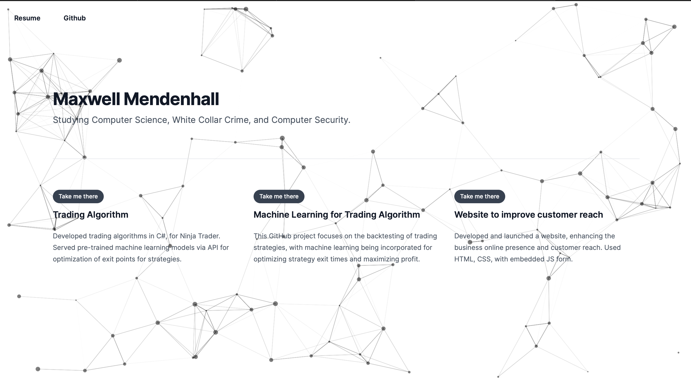

## Getting Started

First, run the development server:

```bash
npm run dev
# or
yarn dev
# or
pnpm dev
# or
bun dev
```

Open [http://localhost:3000](http://localhost:3000) with your browser to see the result.



<pre>
           _          __________                              _,
     _.-(_)._     ."          ".      .--""--.          _.-{__}-._
   .'________'.   | .--------. |    .'        '.      .:-'`____`'-:.
  [____________] /` |________| `\  /   .'``'.   \    /_.-"`_  _`"-._\
  /  / .\/. \  \|  / / .\/. \ \  ||  .'/.\/.\'.  |  /`   / .\/. \   `\
  |  \__/\__/  |\_/  \__/\__/  \_/|  : |_/\_| ;  |  |    \__/\__/    |
  \            /  \            /   \ '.\    /.' / .-\                /-.
  /'._  --  _.'\  /'._  --  _.'\   /'. `'--'` .'\/   '._-.__--__.-_.'   \
 /_   `""""`   _\/_   `""""`   _\ /_  `-./\.-'  _\'.    `""""""""`    .'`\
(__/    '|    \ _)_|           |_)_/            \__)|        '       |   |
  |_____'|_____|   \__________/   |              |;`_________'________`;-'
   '----------'    '----------'   '--------------'`--------------------`
     S T A N          K Y L E        K E N N Y         C A R T M A N
</pre>
